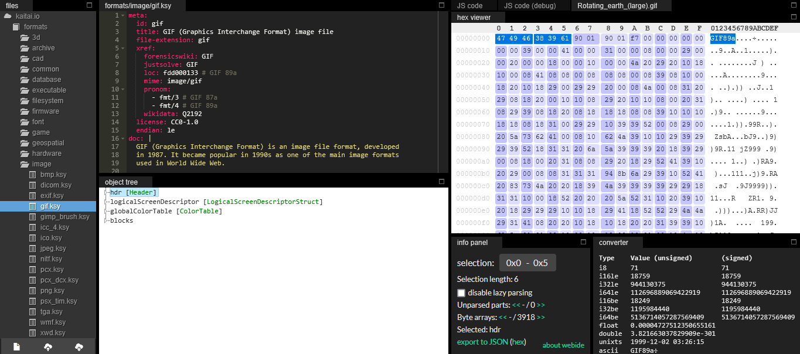

# Defining the Structure in Kaitai

Let's try loading the GIF file in the Kaitai Web IDE to understand this better. Start by navigating to the [Kaitai Web IDE](https://ide.kaitai.io/) if you don't already have it open.

## Anatomy of the Web IDE

On the left side of the webpage, you'll see a list of folders, each containing pre-built `.ksy` files you can use to test functionality. For this example, navigate to `formats/image/gif.ksy` and double-click `gif.ksy` to load it into the IDE. The buttons on the bottom left of the webpage are for creating new `.ksy` files, uploading `.ksy` or data files, and saving `.ksy` files:


```
New, Upload, Save
```

Click the upload button to select a `.gif` file from your computer and load it here. You should now see a webpage that looks like:



The viewer on the far right side should look somewhat familiar: it's the same data as when the file was opened in Notepad, but with unreadable symbols replaced by `.`s, showing the typeable characters alongside their hexadecimal representations.

If you highlight specific characters or sets of characters on either side of the `hex viewer`, the corresponding characters will be highlighted on the other side as well, allowing you to see both the hex code and UTF-8/ASCII representations for any selection. This is also true for the `object tree` section. By clicking on an item in the `object tree` (such as the `hdr` section), the bytes described by the section are automatically selected in the `hex viewer`.

In the same window as the `hex viewer` are the `JS Code` and `JS Code (debug)` sections. These show how the `.ksy` file is being translated into JavaScript, alongside a debugger.

The `converter` section on the bottom right provides multiple ways to convert selected characters, showing different methods of translating a hex code as an integer (e.g., `i8` for an 8-bit integer, `i16le` for a 16-bit integer in little-endian format, etc.).

Finally, there is the `info panel`, which provides information about a selection of bytes, such as the length of the selection and where in the data stream the selection is.

If you are interested in following along more precisely with the `gif.ksy` file, there is also extensive documentation provided to describe the file format. Having documentation about the file format is crucial for describing your file type. Without documentation to follow, this process looks less like declarative programming and more like cryptography, as you would have to decipher and assume/assert the purposes of much of the data unless it happens to be written in plain text already.

We won't fully describe everything being done in the example `.ksy` file here. Instead, we'll look at a broad overview to give an idea of Kaitai's functionality. Now that we know what we're looking at in the IDE, we can take a look at how the file type is being described.

## `meta` and `seq`

Your `.ksy` files should always start with a `meta` section, defining meta-information about your file type such as the file extension (like `.gif` or `.tiff`), title, license, endianness, cross-references, documentation, version, types, encodings, etc.

The `seq` section is where the declarative work really starts. In `seq`, you describe how to handle the raw data. Each entry in `seq` must declare an `id` (the name shown in the object tree for that attribute). You can also specify a `type` (how to interpret the data), a `size` (number of bytes to capture), `contents` (for magic signatures), `encoding`, and more.

When reading the raw data of our GIF, Kaitai will apply the `header` type until its conditions are fulfilled, then the `logical_screen_descriptor_struct` type, then `color_table` type, and finally the `blocks` type. If any type conditions are not fulfilled, the IDE will interrupt parsing and display an error message underneath the object tree.

Instead of investigating all four different `types` in the file's `seq`, let's look only at the first two: `header` and `logical_screen_descriptor`, to learn the basics of using Kaitai.

## Types

The `types` section is where it becomes vital to reference documentation about the file type you're trying to parse. For example, the `gif.ksy` file links to the [GIF89a Specification](https://www.w3.org/Graphics/GIF/spec-gif89a.txt).

While it takes around 150 lines of code to fully describe the types in `gif.ksy`, longer descriptions aren't always necessary depending on your project's scope. For instance, if you expect the first 4 bytes to identify an object's width and height, your type could be settled quickly in the main `seq` section without even having to create a type description:

```yaml
seq:
  - id: width
    type: u2
  - id: height
    type: u2
```

In this example, `u2` could be replaced with `s1`, `s2`, `s4`, `u1`, `u2`, `u4`, etc., where `s` or `u` stands for signed or unsigned bytes, and the number tells the IDE how many bytes to read of that type. However, if you know you'll need to grab a different width and height for some reason, you could instead write this as:

```yaml
seq:
  - id: dimensions
    type: width_and_height

types:
  width_and_height:
    seq:
      - id: width
        type: u2
      - id: height
        type: u2
```

The former method is useful for simple, straightforward data, while the latter is useful for describing repetitive data structures or for reusing types. It allows you to consolidate multiple types into a single place, to repeat types, or to use certain types in the definitions of other types.

When looking at `gif.ksy`'s `header` type, we see:

```yaml
header:
  doc-ref: https://www.w3.org/Graphics/GIF/spec-gif89a.txt - section 17
  seq:
    - id: magic
      contents: 'GIF'
    - id: version
      type: str
      size: 3
      encoding: ASCII
```

The keyword `magic` is especially useful here as a safeguard, acting as a file signature when paired with the `contents` key. It checks that the first bytes match the contents, "GIF" in this case. The `magic` id is then followed by `version`, which grabs the next 3 bytes as denoted by `size` using the built-in `str` (string) type, and specifies that it is using `ASCII` encoding.

This also highlights one of the bigger strengths of Kaitai: in general, it's pretty straightforward to read and understand. It is also for this reason that, if your project would benefit from having both a Kaitai and a Construct definition, it can be easier to first write your Kaitai description and base the Construct file off of that.

This almost-plain-text description strength is also apparent in the next type, `logical_screen_descriptor_struct`:

```yaml
logical_screen_descriptor_struct:
  doc-ref: https://www.w3.org/Graphics/GIF/spec-gif89a.txt - section 18
  seq:
    - id: screen_width
      type: u2
    - id: screen_height
      type: u2
    - id: flags
      type: u1
    - id: bg_color_index
      type: u1
    - id: pixel_aspect_ratio
      type: u1
  instances:
    has_color_table:
      value: '(flags & 0b10000000) != 0'
    color_table_size:
      value: '2 << (flags & 7)'
```

As you can see, it simply grabs the width and the height of the screen on which the GIF will be drawn as 2 unsigned bytes, followed by three unsigned bytes that describe the `flags`, `bg_color_index`, and `pixel_aspect_ratio`. Where it starts to get less straightforward here is in the `instances` section, which are next up to be explained.

### Instances

After the `id`s are set in the type `seq`, we then see the `instances` section. This section sets new variables by manipulating the previously found `flags` object using Kaitai's expression language.

For example, `value: '(flags & 0b10000000) != 0'` is doing something called "bit masking": taking the bits from the `flags` byte and showing only the first one. The beginning `0b` means to read the `flags` object as pure bytes, then the `1` means the first bit is allowed through while the rest are masked with `0`. The value is set as `True` or `False` depending on if the first bit is **NOT** (`!=`) equal to 0. This expression serves as a boolean operation. Either the GIF does or does not have a color table, and this status is encoded in the first bit of the `flags` byte.

It's worth noting that `bytes` are not some fundamental unit of computation. The choice to have 8 bits in one byte was a decision made by the International Organization for Standardization (ISO) and the International Electrotechnical Commission (IEC) in 1993, but 6- and 9-bit bytes were common through the 1960s. Bit masking allows you to use every individual bit or combination of bits in a selection to correspond to a different value, surpassing some of the artificially imposed limits on computation. This could come in especially useful if you are attempting to deal with archival data, or if your project would otherwise benefit from non-standard byte-sizing. 

`color_table_size` is doing a similar operation but with different syntax. `7` in binary is `00000111`, so `(flags & 7)` selects the final 3 bits. `2` in binary is `00000010` and `<<` is the command to "shift" bits to the left, so this command shifts "2" to the left by `(flags & 7)` places. This is equivalent to raising 2 to the power of `1 + (flags mod 8)` and then assigning that new value to a character.

In our case, `flags = 247` (`11110111` in binary), so `has_color_table = True`, and `1 + (flags mod 8) = 1 + (247 mod 8) = 1 + 7 = 8`. Then, $2^8 = 256$, meaning that `color_table_size = 256`.

---

All of this section has been to explain, in broad strokes, some of the types as shown in the GIF file type. If you're interested in reading more about Kaitai Struct Language, the full documentation can be found [here](http://doc.kaitai.io/user_guide.html#_kaitai_struct_language).

For now, let's continue this lesson and talk about how this same file type definition can be performed using the Construct library.

---
Continue to [Construct basics](04_construct_basics.md) to learn how to describe file formats programmatically in Python.