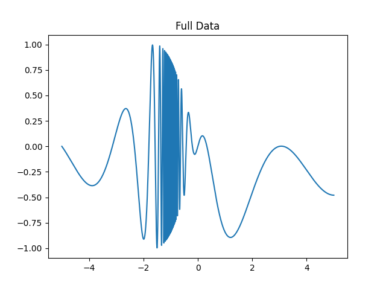
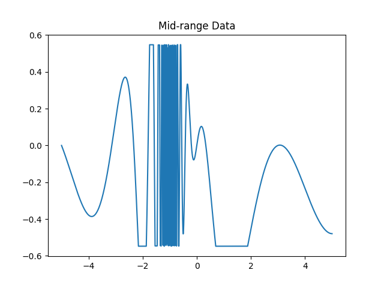
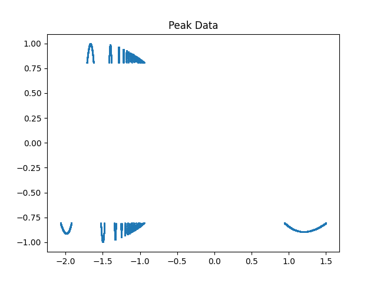

# Creating Example Data

Now that you understand the basics of file formats and parsing tools, let's put everything together by generating some example data, saving it in a binary file, and preparing to describe its structure with Kaitai and Construct. This hands-on section will help you see how real binary data is created and organized.

Suppose we want to simulate a waveform and store it in a binary file. For demonstration, imagine we're measuring vibrations or current intensity. Since we're fabricating data, the context is flexible.

We'll use Python for this example, as it's required for Construct. If you haven't set up your Python environment yet, [return to the setup section](01_setup.md) for instructions.

## Designing the Data Structure

Let's divide our data into three sections based on intensity:
- **Full data:** The entire waveform.
- **Mid-range data:** Only points where the signal is moderate.
- **Peak data:** Only the most intense points.

This could represent three sensors with different sensitivities.

## Preparing Your Environment

You'll need the following Python libraries:
- `numpy` (for numerical arrays)
- `struct` (for binary packing; different from Construct)
- `matplotlib` (optional, for plotting)

To check if these are installed, run:
```
pip list
```
If you don't see `numpy` or `matplotlib`, install them with:
```
pip install numpy
pip install matplotlib
```
> **Note:** There is no package called `python_struct`; `struct` is part of the Python standard library.

## Creating and Visualizing the Data

Create a new `.py` or `.ipynb` file (e.g., `example_data.py`). You can also reference the [example notebook](https://github.com/det-lab/lessons-data-format/blob/gh-pages/examples/example_data.ipynb).

Import the necessary modules:
```python
import numpy as np
import struct
import matplotlib.pyplot as plt
```

Now, initialize arrays for each section:
```python
full_x, full_y = [], []
mid_x, mid_y = [], []
peak_x, peak_y = [], []
```

Populate these arrays with simulated data. For example, generate 100,000 points from `x = -5` to `x = 5` using the (totally arbitrary) equation $y=cos(\frac{2 \pi x^2}{x^2 +x})sin(x)$:
```python
for x in np.arange(-5, 5, 0.0001):
    y = (np.cos((2 * np.pi * x**2)/(x**2 + x))) * np.sin(x)
    full_x.append(x)
    full_y.append(y)
    if y**2 < 0.3:
        mid_x.append(x)
        mid_y.append(y)
    if y**2 > 0.65:
        peak_x.append(x)
        peak_y.append(y)
```

You can then visualize the data:
```python
plt.plot(full_x, full_y)
plt.title("Full Data")
plt.show()

plt.plot(mid_x, mid_y)
plt.title("Mid-range Data")
plt.show()

plt.scatter(peak_x, peak_y, s=1)
plt.title("Peak Data")
plt.show()
```

The resulting graphs should look like:





## Saving Data as Binary

Convert your lists to numpy arrays with a specific data type (e.g., `float32` for 4 bytes per value):
```python
full_x_data = np.array(full_x, dtype=np.float32)
full_y_data = np.array(full_y, dtype=np.float32)
mid_x_data = np.array(mid_x, dtype=np.float32)
mid_y_data = np.array(mid_y, dtype=np.float32)
peak_x_data = np.array(peak_x, dtype=np.float32)
peak_y_data = np.array(peak_y, dtype=np.float32)
```
> You can experiment with other types like `float64`, `float16`, or even integer types if you wish.

When saving binary data, it's helpful to include the length of each section at the start of the file or near the front of its respective section. This makes parsing easier later. 

```python
with open('wave_data.test', 'wb') as f:
    # Write array lengths as unsigned 4-byte integers
    f.write(struct.pack('I', len(full_y_data)))
    f.write(struct.pack('I', len(mid_y_data)))
    f.write(struct.pack('I', len(peak_y_data)))
    # Write all arrays in order
    full_x_data.tofile(f)
    full_y_data.tofile(f)

    mid_x_data.tofile(f)
    mid_y_data.tofile(f)

    peak_x_data.tofile(f)
    peak_y_data.tofile(f)
```

You now have a binary file called `wave_data.test` in your working directory. The file extension is arbitrary; modern systems do not require three-letter extensions.

---
Continue to [Kaitai Next Steps](07_kaitai_next_steps.md) to describe and parse your custom data with Kaitai Struct.