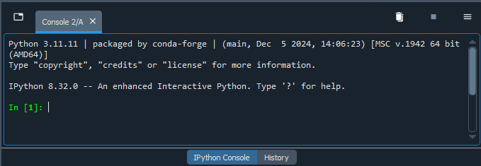
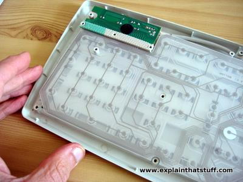
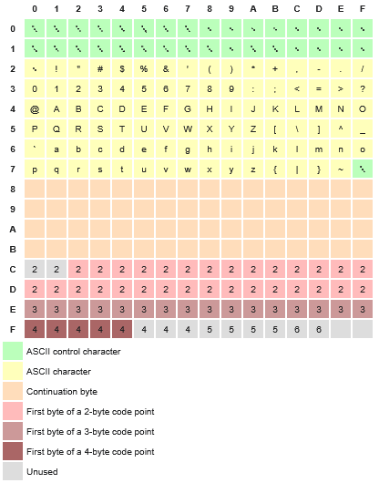

# Custom Data Formatting Lesson
**Created by Adrian Fisher**

# Table of Contents:

- [Table of Contents](table-of-contents)
- [1. Introduction](#1-introduction)
- [2. Setup](#2-setup)
    - [2.1 Kaitai IDE](#21-kaitai-ide)
    - [2.2 Python Setup](#22-python-setup)
    - [2.3 Construct Setup](#23-construct-setup)
- [3. Introduction: What is a file type?](#3-introduction-what-is-a-file-type)
    - [3.1 Computer language and number systems](#31-computer-language-and-number-systems)
      - [3.1.1 Counting in binary and hexadecimals](#311-counting-in-binary-and-hexadecimals)
    - [3.2 Opening a file](#32-opening-a-file)
- [4. Defining the Structure in Kaitai](#4-defining-the-structure-in-kaitai)
    - [4.1 Anatomy of the Web IDE](#41-anatomy-of-the-web-ide)
    - [4.2 meta and seq](#41-meta-and-seq)
    - [4.3 Types](#43-types)
- [5. Defining the Structure in Construct](#5-defining-the-structure-in-construct)
  - [5.1 Structs](#51-structs)
- [i. Advanced](#i-advanced)
  - [Advanced Kaitai Users](#advanced-kaitai-users)
  - [Advanced Construct Users](#advanced-construct-users)

# 1. Introduction

It's common in the scientific community to record data in a custom format which might be unreadable to existing applications or programming languages. This means that in the processes of data analysis for a project, it can sometimes be necessary to create and describe a new file type. This lesson will be exploring first how to setup your computer to use Kaitai and Construct before explaing how they can be used to translate one's custom binary data to make it easier to use. Construct is designed specifically for use with the Python programming language, while Kaitai can be used to work in Python, CSharp, Java, Javascript, Perl, PHP, or Ruby. 

# 2. Setup

Installation isn't strictly necessary for working with Kaitai, but is required for working with Construct. 

## 2.1 Kaitai IDE

For Kaitai, the [Web IDE](https://ide.kaitai.io/) (Integrated Development Environment) is the simplest way to get started, and is all that is necessary for this lesson. If you're already familiar with the language you can use the Web IDE to jump straight in to describing your data format. If you're not familiar, it's recommended to read through the existing [documentation](https://doc.kaitai.io/user_guide.html). The instructions in section [4. Defining the Structure in Kaitai](#4-defining-the-structure-in-kaitai) reference the documentation enough to describe one file type, but the actual documentation provides a much more complete description of Kaitai's syntax and its available commands. Advanced users may wish to install `ksc`, the `kaitai-struct-compiler`, or `ksv`, the `kaitai-struct-visualizer` directly onto their own machine. Instructions to do so are included in the [Advanced Kaitai Users](#advanced-kaitai-users) section.

## 2.2 Python Setup

In order to use Construct, it is necessary to have Python installed on your machine. If that is already the case for you and you are already familiar with an IDE of your choice, this section can be skipped.

There are numerous IDEs with which one can use for programming in Python: Spyder, Anaconda, Visual Studio Code, and Pycharm are popular choices, just to name a few. For this lesson, it is recommended to install and familiarize yourself with the Spyder environment, which can be downloaded and installed from [here](https://www.spyder-ide.org/). Spyder is an open-source program which was built in Python, for Python, specifically for use in data science. 

By following the link, you should have the option to download the IDE for your operating system, at which point you can follow the guided installation. The IDE should open after the installation is complete, at which point it is recommended to follow along with the tour for a quick overview of the IDE.

## 2.3 Construct Setup

After installing the Python IDE of your choice, open or navigate to the console. In Spyder, the console is found as the window on the bottom right (by default), and should resemble the below image.



If you're having trouble finding the console, or have removed the window by accident (or on purpose and are unsure how to return it), it should be possible to turn it back on by navigating to `View` > `Panes` > and checking the box next to `IPython Console`. Alternatively on Windows, you can also type `CTRL+SHIFT+I` to open or close the console window.

Construct doesn't have any hard dependencies, but all supported modules can be installed as well with a single command. The basic version of Construct is enough for this lesson. To install it, you should only need to type or copy the following into the console and hit enter:

```
pip install construct
``` 

Advanced users can refer to the section [Advanced Construct Users](#advanced-construct-users) for further instructions.

# 3 Introduction: What is a file type?
While it's easy to say that a `.jpg` "is a picture", a `.gif` "is an animation", or a `.txt` "is a text document" let's back up and think about how data is stored on a computer and translated into something that we can read and understand. 

Humans have invented what are now pretty familiar systems for interacting with computers, but it's important to remember that we interact with computers through several layers of culturally specific translations, abstractions, and conveniences that exist as barriers between our world of symbols and the laws of electromagnetism. We have spent much of the last century learning to shape metals and electricity into incredibly complex devices which we call things like "processing units" or "graphics cards". These tools can then deliver us images of things that we call "cats" and graphs to represent something called "the economy" when combined with a monitor of some kind. The point being that *every* file type is a custom set of instructions used to load a file format which someone, somewhere, had to teach a computer to interpret. 

A file `type` describes the extension used at the end of a file's name, such as `.jpg`, `.gif`, or `.txt`. The extension suggests to a program which `format` to use to read a given file. It is possible for different file types to share file formats, such as `.jpg` and `.jpeg`. It is also possible for different file formats to share a file type, such as `.bin`, which enough versatility to describe executable binary files, game ROMs, or even CD/DVD data. File formats and file types both exist as a type of convenient convention rather than as strict rules, however if you try to open an executable binary file as a game ROM, the program is likely to produce errors or fail entirely to correctly interpret the data, unless the program is prepared for both possibilities.

As file types and formats become more niche and specific to a project, it is up to developers to define their new file formats and create the software necessary to read a string of `1`s and `0`s and return something that humans can understand. 

## 3.1 Computer language and number systems

In some sense, a file format is a set of instructions that a program needs in order to be able to successfully open and/or save a file. Given a collection of bytes, a program will perform a set of computations to determine how to convert those bytes into a human-readable format. When considering the string of `1`s and `0`s mentioned earlier, we can ask one of the fundamental questions of computer science: How are `1`s and `0`s generated in the first place?

Let's say you want to take some data under an existing file type, such as writing your results down in a `.txt` document. When you type a character on your keyboard, the mechanical action presses conductive material into place against a complex printed circuit laying underneath the key, allowing for a current to flow through a distinct path. 



`
Woodford, Chris, (2022). Computer Keyboards
`

`
https://www.explainthatstuff.com/computerkeyboards.html#keys
`

The current will then enter the keyboard's microcontroller, its "brain", where the resulting signal is converted into a binary representation of `1`s and `0`s. However, even this familiar numerical representation is a convenient abstraction used to explain a physical system comprised of transistors and capacitors which exist inside of a computer's memory cells.

The circuit which was completed by the key press allows for a current to flow from a power source to different systems in the computer, eventually charging a series of capacitors in its memory cells. When a capacitor is charged, we call it a `1`, and when it's discharged, we call it a `0`, representing the **binary** states available of charged or uncharged (this is completely thrown out of the window however for quantum computing systems, but they are very much outside of the scope of this lesson). The series of charged/uncharged cells is then held and written from a specific location inside of the computer's Random Access Memory (RAM) chip until the file is saved, at which point it can be moved onto the computer's hard drive. This is true even if you save something using what has become known as "the cloud", a series of decentralized computers. Even on these, in order to save a file, some physical set of capacitors and transistors must be manipulated on a computer server. Normally, if you're paying for a "cloud" service, the servers are owned and operated by the company which you are paying, ideally with layers of encryption and security to protect your data.

It's in this way that the typed character `a` gets translated into the binary representation `01100001`. Each character's binary representation can also be said to represent where in your computer's circuitry a current was and wasn't allowed to pass through specific paths. Each character one can type is thus represented by a `byte`, which is a number 8 digits long, represented in the binary counting system. Binary is a **base two** counting system, meaning that one byte can represent any value between `00000000` and `11111111`, or any number between 0 and 255 when written in the familiar decimal representation.

Ok, but what is a "base two" counting system?

### 3.1.1 Counting in binary and hexadecimals

To understand counting systems, remember that the number system humans are used to were derived almost entirely from the fact that our species happens to have 10 fingers. As a result, we use what is called a "base 10" counting system. If we happened to have 8 fingers, we would instead likely use a "base 8" counting system. 

In base 10, the number "3125" could be interpreted as there being a 3 in the "thousand" or $10^3$ place, a 1 in the "hundred" or $10^2$ place, a 2 in the "ten" or $10^1$ place and a 5 in the "ones" or $10^0$ place, so: 

$$3125 = (3 \cdot 10^3) + (1 \cdot 10^2) + (2 \cdot 10^1) + (5 \cdot 10^0)$$

Each new digit represents an additional $10^n$, where $n$ is the digit's place from the right, starting from 0. This can be continued for digits representing numbers between 0 and 1 as well, or where $n < 0$. Here, $0.1$ can be equivalently represented as $(1 \cdot 10^{-1})$, $0.01$ as $(1 \cdot 10^{-2})$ and so on.

The same is true for a binary counting system, only instead of the places being determined by powers of 10, they're determined by powers of 2. Binary is pretty simplistic as such, as any 1 or 0 simply means that there is or isn't a number in that place. So `01100001` becomes: 

$$(0 \cdot 2^7) + (1 \cdot 2^6) + (1 \cdot 2^5) + (0 \cdot 2^4) + (0 \cdot 2^3) + (0 \cdot 2^2) + (0 \cdot 2^1) + (1 \cdot 2^0)$$

Which when represented in decimal (base 10) form becomes 97. 

Another common numerical system that one should be familiar with when working with raw data is hexadecimals. While binary shortens the number of allowed numbers to 2: 0 & 1, hexadecimals is a base 16 counting system, extending our counting options per digit from 0-9 up to 15. To represent numbers higher than 9 in this system, we instead use the letters A-F, where A = 10, B = 11, ..., F = 15. 

Hexadecimal are used by software developers and the like because each hexadecimal digit can represent four `bits` (also known as a `nibble` or `nybble`), meaning that one byte can be expressed in hexadecimal using only two characters. This makes the counting system much faster to represent, as 256 can be either `11111111` when represented in binary, or `FF` in hexadecimals. The letter `a`, can now be represented as `01100001` in binary, `97` in decimal or `61` in hexadecimals, following:

$$(6 \cdot 16^1) + (1 \cdot 16^0)$$

To summarize, when you open a text editing program such as Notepad and begin recording data, every new typed character appends a number between 0 and 255 to the end of your document. Inside the components of your computer, this physically translates to a group of capacitors becoming charged or discharged. Other systems of the computer can then store and retrieve the positions of those capacitors as well as their current state. Then, when you open the file in a program, the values are assigned to different characters or other graphical representations depending on the program. Each program is provided with a set of instructions to translate these values into a representation of some kind.

So, let's talk about that set of instructions next. How does your computer take what is essentially a large number saved on your computer's memory cards and turn it into a document you can understand? How do text editors know to open a `.txt` file and represent what it reads as `01100001` as the letter `a`? 

## 3.2 Opening a file

Notepad and other plain text editors are pretty straightforward to understand. Generally, they convert all of the inputted data from binary into characters using encoding instructions such as Unicode Transformation Format - 8-bit (`UTF-8`) or the American Standard Code for Information Interchange (`ASCII`). `UTF-8` is the preferred option, with 99% of average global use, but it was designed to be backwards compatible with `ASCII`, and the two systems share the first 128 characters. The map explaining how characters are selected from a given byte (converted into hexadecimals) looks like:


```
UTF-8 Byte Map, from https://en.wikipedia.org/wiki/UTF-8#Byte_map
```

Here, the row selects the first hex character of a byte and the column selects the second. You can find `a` here in row 6, column 1. 

Since Notepad translates all of the information of a file through UTF-8, it's pretty useful to illustrate what data is contained in other file types. Let's see what happens when we try to use Notepad to open a file type that it wasn't designed for, such as a `GIF`. `GIF` stands for "Graphics Interchange Format", and is notable for being able to represent multiple images in a single file, so the file type is often used for animations. For this example, we'll be using a gif taken from Wikipedia's article on the subject of GIFs:


```
Rotating_earth_(large).gif, from https://en.wikipedia.org/wiki/GIF
```

When we try to open the above file with Notepad, the result is a jumble of nonsense characters, which should look something like:


You might notice in that collection of seemingly random symbols that there are still some understandable combinations of characters, such as the first 3 which spell out "GIF", or further down on the left side you can find "NETSCAPE2.0".

A program which was designed to open that file has instructions to use all of these seemingly random bytes to assign values to the width and height of a window in which to draw the image, the number of the frames that the image will be drawn on, and the RGB color of every pixel in every frame.

While Kaitai and Construct aren't designed to show you the final animation, they are designed to allow you to translate the raw data into something usable so that you can then load all of that information elsewhere.

# 4 Defining the Structure in Kaitai

Let's try loading the GIF file in the Kaitai Web IDE to understand this better. Start by navigating to the [Web IDE](https://ide.kaitai.io/) if you don't already have it open. 

## 4.1 Anatomy of the Web IDE

On the left side of the webpage, you'll see a list of folders, each containing pre-built `.ksy` files which you can use to test functionality. For this example, navigate to `formats/image/gif.ksy`, and double click `gif.ksy` to load it into the IDE. The buttons on the bottom left of the webpage are for creating new `.ksy` files, uploading `.ksy` or data files, and saving `.ksy` files respectively:


```
New, Upload, Download
```

Click the upload button to navigate to a `.gif` file and load it here. You should now see a webpage that looks like:


The viewer on the far right side should look somewhat familiar: it's the same data as when the file was opened in Notepad, now just with several of the unreadable symbols replaced with `.`s instead of Notepad's `` symbol, showing the typeable characters alongside their hexadecimal representations. 

If you click to highlight specific characters or sets of characters on either side of the `hex viewer`, the corresponding characters will be highlighted on the other side as well, allowing you to see both the hex code and UTF-8/ASCII representations for any selection. This is also true for the `object tree` section. By clicking on an item in the `object tree` underneath the `.ksy` file such as the `hdr` section, the bytes described by the section are automatically selected in the `hex viewer`. 

In the same window as the `hex viewer` are the `JS Code` and `JS Code (debug)` sections. These show how the `.ksy` file is being translated in the `JavaScript` programming language alongside a debugger.

The `converter` section on the bottom right of the screen provides multiple different possible ways to convert selected characters. These show different methods of translating a hex code as an integer, such as `i8`, which is an 8-bit integer, `i16le` which is a 16-bit integer in `little endian` format, and so on. 

Finally, there is the `info panel` which provides information about a selection of bytes, such as the length of the selection and where in the data stream the selection is.

If you are interested in following along more precisely with the `gif.ksy` file, there is also extensive documentation provided to describe the file format. Having documentation about the file format is crucial for describing your file type. Without documentation to follow, this process looks less like declarative programming and more like cryptography, as you would have to decipher the purpose of much of the binary data unless it happens to be written in plain text already. It's not impossible, just definitely not an ideal or efficient method.

We won't fully describe everything being done in the example `.ksy` file here, instead we are just going to look at a broad overview to give an idea of how to use the program. Now that we know what we're looking at in the IDE, we can take a look at how the file type is being described.

## 4.2 meta and seq

Your `.ksy` files should always start with a `meta` section, defining the meta-information of your file type such as the file extension (like `.gif` or `.tiff`, etc), titles, licenses, endianness (what byte-order the file should be read in), cross-references, miscellaneous documentation (like lines 17-33 of `gif.ksy`), versions, types, encodings, etc.

The `seq` section is where the declarative work really starts. In `seq`, we can begin to describe how to handle the raw data. While it is possible to directly define streams in `seq`, it is necessary to first declare an `id` which will be the name shown in the object tree for any given attribute. You can also specify information such as a `type`, which tells the IDE what to do with the data in that section, a `size` which states the number of bytes for the object to capture, `content` can be specified for `magic` signatures, `encoding` choice can be determined here, etc.

The `types` are then executed in the order that they're declared in `seq`, meaning that when reading the raw data of our gif, it'll apply the `header` type until its type conditions are fulfilled, then `logical_screen_descriptor_struct`, then `color_table`, and finally `blocks`. If for some reason any of the type conditions are unable to be fulfilled, the IDE will interrupt parsing and display an error message underneath the object tree.

Instead of investigating all four different `types` in the file's `seq`, let's instead look only at the first two: `header` and `logical_screen_descriptor` to get a better idea of how Kaitai operates.

## 4.3 Types

The `types` section is where it becomes vital to reference documentation around the file type you're trying to parse. A link to the documentation is provided in the `gif.ksy` file for the first time on line 43 for the `glocal_color_table` section, pointing the user to section 18 of the [Cover Sheet for the GIF89a Specification](https://www.w3.org/Graphics/GIF/spec-gif89a.txt).

While it takes around 150 lines of code to full describe the types in `gif.ksy` (from line 48-197), longer descriptions aren't always necessary depending on the scope of your project. For instance, if you would expect the first 4 bytes to identify an object's width and height, your type could be settled quickly in the main `seq` section without ever having to create a type description, as:
```
seq:
  - id: width
    type: u2
  - id: height
    type: u2
```
In this example, `u2` could be replaced with `s1`, `s2`, `s4`, `u1`, `u2`, `u4`, etc, where `s` or `u` stands for signed or unsigned bytes, and the number tells the IDE how many bytes to read of that type. However, if we knew that we would later need to grab a different width and height for some reason, we could instead write this as:
```
seq:
  - id: dimensions
    type: width_and_height

...

types:
  width_and_height:
    seq:
      - id: width
        type: u2
      - id: height
        type: u2
```
The former method is useful for simple, straightforward data, while the latter is useful for describing repetitive data structures or reusing types. It allows you to consolidate multiple types into a single place, to repeat types, or to use certain types in the definitions of other types.

When looking at `gif.ksy`'s `header` type, we see:
```
  header:
    doc-ref: https://www.w3.org/Graphics/GIF/spec-gif89a.txt - section 17
    seq:
      - id: magic
        contents: 'GIF'
      - id: version
        type: str
        size: 3
        encoding: ASCII
```
The keyword `magic` is especially useful here as a type of safeguard, acting as a file signature when paired with the `contents` key. It simply checks that the first bytes match up with the contents, "GIF" in this case. The `magic` id is then followed by `version`, which simply grabs the next 3 bytes as denoted by `size` using the built in `str` (string) type, and specifies that it is using `ASCII` encoding.

This also highlights one of the bigger strengths of Kaitai - its readability. For the most part, it's a very straightforward language.
This strength is also apparent in the next type, `logical_screen_descriptor_struct`:
```
  logical_screen_descriptor_struct:
    doc-ref: https://www.w3.org/Graphics/GIF/spec-gif89a.txt - section 18
    seq:
      - id: screen_width
        type: u2
      - id: screen_height
        type: u2
      - id: flags
        type: u1
      - id: bg_color_index
        type: u1
      - id: pixel_aspect_ratio
        type: u1
    instances:
      has_color_table:
        value: '(flags & 0b10000000) != 0'
      color_table_size:
        value: '2 << (flags & 7)'
```

As you can see, it simply grabs the width and the height of the screen on which the gif will be drawn as 2 unsigned bytes, followed by three unsigned bytes that describe the `flags`, `bg_color_index`, and `pixel_aspect_ratio`. 

### 4.3.1 Instances

After the `id`s are set in the type `seq`, we then see an `instances` section. This section is setting new variables by manipulating the previously found `flags` object using Kaitai's expression language. 

```value: '(flags & 0b10000000) !=0'``` is doing something called "bit masking"; taking the bits from the `flag` byte and showing only the first one. The beginning `0b` simply means to read the `flags` object as bytes for the masking, then the `1` means the first bit is allowed through while the rest are masked with `0`, so are blocked from being read. The value is set as `True` or `False` depending on if the first bit is NOT (`!=`) equal to 0. This is a boolean operation - either the gif does or does not have a color table, which is revealed by the first bit in the `flags` byte. 

This is a good time to mention that `bytes` are not some kind of fundamental unit of computation. The choice to have 8 bits in one byte was a decision made by the International Organization for Standardization (ISO) and the International Electrotechnical Commmission (IEC) in 1993, but 6 and 9 bit bytes were common through the 1960s. Bit masking can allow for one to use every individual bit or combination of bits in a selection to correspond to a different value. In this way, one can surpass some of the artificially imposed limits on computation.

`color_table_size` is doing a similar operation but with different syntax. `7` in binary is `00000111`, so ```(flags & 7)``` is selecting the final 3 bits. `2` in binary is `00000010` - `<<` is the command to shift bits to the left, so that command shifts 2 to the left by `flags & 7` places. This is equivalent to raising 2 to the power of `1+(flags mod 8)` and then assigning that new value to a character.

In our case, `flags` = 247, or `11110111`, so `has_color_table = True`, and `1+(flags mod 8) = 8`, $2^8 = 256$, so `color_table_size = 256`

All of this section has been to explain, in broad strokes, some of the types as shown in the `GIF` file type. If you're interested in reading more about Kaitai Struct Language, the full documentation can be found [here](http://doc.kaitai.io/user_guide.html#_kaitai_struct_language). For now, let's continue this lesson and talk about how this same file type definition can be done with the Construct library.

# 5. Defining the Structure in Construct

As mentioned earlier, Construct is a library designed to work specifically in Python, but it's functionality is similar to the functionality of Kaitai, just with more programmatic language. In Construct, we define `Structs` which are similar to `types` in Kaitai. By describing the structure of different sections of the data byte by byte, `Structs` can be combined with each other to capture larger sections of the data until they're combined in a final `Struct` which can capture all of the file's data.

We can start by opening the [github page for Construct](https://github.com/construct/construct/blob/master/deprecated_gallery/gif.py) at the definition for `.gif`. 

## 5.1 Structs

In Construct, a `Struct` is a collection of ordered and (usually) named fields that are parsed or built in the defined order. The object can then be either parsed when reading in a file's data or built to create a file with the type definitions. When a `Struct` is parsed, values are returned in a dictionary with keys matching the defined names, but names aren't strictly necessary like they are in Kaitai. It's possible to instead build from nothing and return nothing when parsing, so a name can be skipped in those instances. To recreate our dimension example from the Kaitai section, we can define a `Struct` as:

```
dimensions = Struct(
    "width" / Int16ul,
    "height" / Int16ul
)
```

`Int16ul` here means that we are deciphering the width and height as an `Int`eger of `16` `u`nsigned bits in `l`ittle endian format. To show how that type could then be used elsewhere, we could define another `Struct` using it:

```
example = Struct(
  "dimensions" / dimensions
)
```

When we look at `gif.py`, we can see that the structure is almost reversed when compared to Kaitai. This is because the structures in Kaitai are global - the order is arbitrary as long as they're placed in the right sections (`types` or `seq`), while in Construct the structures are read in order. This means that we can't use a type that hasn't yet been defined somewhere else in the parsing instructions. Let's try looking at the file backwards then, starting with the final `Struct` on line 121:

```
gif_file = Struct(
    "signature" / Const(b"GIF"),
    "version" / Const(b"89a"),
    "logical_screen" / gif_logical_screen,
    "data" / GreedyRange(gif_data),
    # Const(Int8ul("trailer"), 0x3B)
)
```

In the `gif_file` Struct, we can see that instead of there being a defined `header` `Struct`, we can instead grab the `signature` and `version` as `Const` (constant) types. The only downside to doing it this way as opposed to setting a `Struct` earlier which can dynamically grab that information is that it will fail to parse if the version is different than the defined `89a`. After those, we see `"logical_screen" / gif_logical_screen`, `"data" / GreedyRange(gif_data)`, and an optional (commented out) `Const(Int8ul("trailer"), 0x3B)`. Let's start by looking at our `logical_screen` struct which can be found at line 20 to see how it is defined in Construct:

```
gif_logical_screen = Struct(
    "width" / Int16ul,
    "height" / Int16ul,
    "flags" / BitStruct(
        "global_color_table" / Bit,
        "color_resolution" / BitsInteger(3),
        "sort_flag" / Bit,
        "global_color_table_bpp" / BitsInteger(3),
    ),
    "bgcolor_index" / Int8ul,
    "pixel_aspect_ratio" / Int8ul,
    "palette" / If(this.flags.global_color_table,
        Array(lambda this: 2**(this.flags.global_color_table_bpp + 1),
            Struct(
                "R" / Int8ul,
                "G" / Int8ul,
                "B" / Int8ul,
            ))),
)
```

Here we can see that `width` and `height` have the expected definitions, but `flags` is using something called a `BitStruct`. These are much like a normal `Struct`, but designed to operate on bits instead of bytes. In parsing these, the data is converted to a stream of `\x01` and `\x00`s (`1`s and `0`s) and then fed into the subconstructs. So `global_color_table` grabs just the first bit, `color_resolution` grabs the next 3 bits and parses them as an integer, etc. These values are then used in `palette` if `global_color_table` is `True` (`1`), and an `Array` is constructed with a length determined by raising 2 to the power of `global_color_table_bpp + 1` where each element in the array is another `Struct` defining the RGB values of each pixel.

# Conclusion

TODO

Include YT community dev mailing list (yt-dev@python.org), Professor Roberts' email, kaitai gitter link

# i. Advanced

## Advanced Kaitai Users

There are several reasons that one might choose to install the `Kaitai-Struct-Compiler` directly onto their machines as opposed to using the Web IDE. The desktop and console versions can also be used when you're done using the Web IDE to compile the file for other programming languages. The different OS downloads are available [here](https://kaitai.io/#download).

After installation, you should have:
* `ksc` (`kaitai-struct-compiler`) - a command line Kaitai Struct Compiler which translates `.ksy` files into parsing libraries for a chosen target language.
* `ksv` (`kaitai-struct-visualizer`, optional) a console visualizer

## Advanced Construct Users

While not necessary for this lesson, if you instead wish to install all the supported modules alongside your Construct install, instead type or copy the following and hit enter:

```
pip install construct[extras]
``` 