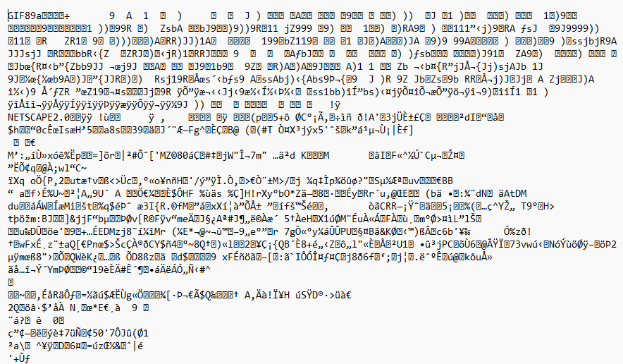

# 3: What is a file type?
While it's easy to say that a `.jpg` "is a picture", a `.gif` "is an animation", or a `.txt` "is a text document" let's back up and think about how data is stored on a computer and translated into something that we can read and understand. 

Humans have invented what are now pretty familiar systems for interacting with computers, but it's important to remember that we interact with computers through several layers of culturally specific translations, abstractions, and conveniences that exist as barriers between our world of symbols and the laws of electromagnetism. We have spent much of the last century learning to shape metals and electricity into incredibly complex devices which we call things like "processing units" or "graphics cards". These tools can then deliver us images on demand of things that we call "cats", or even graphs to represent something called "the economy" when combined with a monitor of some kind. The point being that *every* file type is custom. Someone, somewhere, created a set of instructions which can be used to teach a computer program how to load a specific file format. 

A file `type` describes the extension which is used at the end of a file's name, such as `.jpg`, `.gif`, or `.txt`. The extension tells a program which `format` to use to read a given file. It is possible for different file types to share file formats, such as `.jpg` and `.jpeg`, and it is also possible for different file formats to share a file type, such as `.bin`. The `.bin` (short for binary) file type can be used to describe file formats ranging from executable binary files, game ROMs, or even CD/DVD data. File formats and file types both exist as a set of conventions rather than as strict rules. However, if you try to open an executable binary file as a game ROM, the program is likely to produce errors or simply fail to correctly interpret the data - unless the program is already prepared for either possibility.

As file types and formats become more niche and specific to a project, it is up to developers to define their new file formats and create the software necessary to read a string of `1`s and `0`s and return something that humans can understand. 

## 3.1 Computer language and number systems

In some sense, a file format is a set of instructions that a program needs in order to be able to successfully open and/or save a file. Given a collection of bytes, a program will perform a set of computations to determine how to convert those bytes into a human-readable format. When considering the string of `1`s and `0`s mentioned earlier, we can ask one of the fundamental questions of computer science: How are `1`s and `0`s generated in the first place?

Let's say you want to take some data under an existing file type, such as writing your results down in a `.txt` document. When you type a character on your keyboard, the mechanical action presses conductive material into place against a complex printed circuit laying underneath the key, allowing for a current to flow through a distinct path. This isn't necessarily true for every method of documenting characters, such as touch screens or speech-to-text, but the underlying principle is still important to note.


`
Woodford, Chris, (2022). Computer Keyboards
`

`
https://www.explainthatstuff.com/computerkeyboards.html#keys
`

The current will then enter the keyboard's microcontroller, its "brain", where the resulting signal is converted into a binary representation of `1`s and `0`s. However, even this familiar numerical representation is a convenient abstraction used to explain a physical system comprised of transistors and capacitors which exist inside of a computer's memory cells.

The circuit which was completed by the key press allows for a current to flow from a power source to different systems in the computer, eventually charging a series of capacitors in its memory cells. When a capacitor is charged, we call it a `1`, and when it's discharged, we call it a `0`, representing the **binary** states available of charged or uncharged (this is completely thrown out of the window for quantum computing systems, but they are very much outside of the scope of this lesson). The series of charged/uncharged cells is then held and written from a specific location inside of the computer's Random Access Memory (RAM) chip until the file is saved, at which point it can be moved onto the computer's hard drive. This is true even if you save something using what has become known as "the cloud", a series of decentralized computers. Even on these, in order to save a file, some physical set of capacitors and transistors must be manipulated on a computer server. Normally, if you're paying for a "cloud" service, the servers are owned and operated by the company which you are paying, ideally with layers of encryption and security to protect your data.

It's in this way that the typed character `a` gets translated into the binary representation `01100001`. Each character's binary representation can also be said to represent where in your keyboard's circuitry a current was and wasn't allowed to pass through specific paths. Each character one can type is thus represented by a `byte`, a number 8 digits long represented in the binary counting system. Binary is a **base two** counting system, meaning that one byte can represent any value between `00000000` and `11111111`, or any number between 0 and 255 when written in the familiar base ten (decimal) system.

Ok, so what exactly is a "base two" counting system?

### 3.1.1 Counting in binary and hexadecimals

To understand counting systems, remember that the number system humans are used to were derived almost entirely from the fact that our species happens to have 10 fingers. As a result, we use what is called a "base 10" or "decimal" counting system. If we happened to have 8 fingers, we would instead likely use a "base 8" counting system. 

In base 10, the number "3125" could be interpreted as there being a 3 in the "thousand" or $10^3$ place, a 1 in the "hundred" or $10^2$ place, a 2 in the "ten" or $10^1$ place and a 5 in the "ones" or $10^0$ place, so: 

$$
3125 = (3 \cdot 10^3) + (1 \cdot 10^2) + (2 \cdot 10^1) + (5 \cdot 10^0)
$$

Each new digit to the left represents an additional $10^n$, where $n$ is the digit's index, starting from 0. This can be continued for digits representing numbers between 0 and 1 as well, or where $n < 0$. Here, $0.1$ can be equivalently represented as $(1 \cdot 10^{-1})$, $0.01$ as $(1 \cdot 10^{-2})$ and so on.

The same is true for a binary counting system, only instead of the places being determined by powers of 10, they're determined by powers of 2. Binary is pretty simplistic as such, as any 1 or 0 simply means that there is or isn't a number in that place. So `01100001` becomes: 

$$
(0 \cdot 2^7) + (1 \cdot 2^6) + (1 \cdot 2^5) + (0 \cdot 2^4) + (0 \cdot 2^3) + (0 \cdot 2^2) + (0 \cdot 2^1) + (1 \cdot 2^0)
$$

Which when represented in decimal form becomes `97`. 

Another common numerical system that one should be familiar with when working with raw data is hexadecimals. While binary shortens the number of allowed symbols per digit to only 2 (0 & 1), hexadecimals is a base 16 counting system, extending the available symbols per digit from decimal's 10 (0-9) up to 16. To represent numbers larger than 9 in this system, we instead use the letters A-F, where A = 10, B = 11, ..., F = 15. 

Hexadecimal are used by software developers and the like because each hexadecimal digit can represent four `bits` (also known as a `nibble` or `nybble`), meaning that one byte can be expressed in hexadecimal using only two characters. This makes the counting system much faster to represent, as 255 can be either `11111111` when represented in binary, or `FF` in hexadecimals. The letter `a`, can now be represented as `01100001` in binary, `97` in decimal or `61` in hexadecimals, following:

$$
(6 \cdot 16^1) + (1 \cdot 16^0)
$$

To summarize, when you open a text editing program and begin recording data, every new typed character appends a number between 0 and 255 to the end of your document. Inside the components of your computer, this physically translates to a group of capacitors becoming charged or discharged. Other systems of the computer can then store and retrieve the positions of those capacitors as well as their current state. Then, when you open the file in a program, the values are assigned to different characters or other graphical representations depending on the program. Each program is provided with a set of instructions to translate these values into a representation of some kind.

So, let's talk about that set of instructions next. How does your computer take what is essentially a large number saved on your computer's memory cards and turn it into a document you can understand? How do text editors know to open a `.txt` file and represent what it reads as `01100001` as the letter `a`?

### 3.1.2 Endianness

One of the first steps that a computer follows when opening a file relates to the system's `endianness`. This refers to the order that the computer will read the bytes of a given `word`, which is a fixed number of bytes, normally set by the computer's processor. There are two main types of endianness: `big-endian` (BE) or `little-endian` (LE). 

Let's say that your computer defines a `word` as four bytes. We can then think of endianness like writing down a 4-digit number on a piece of paper. Let's say we want to write the number `2024`:

* In big-endian, the number would be written straightforwardly: `2-0-2-4`. The most significant digit (the leftmost one) comes first, in the smallest memory address available to the computer, and the least significant digit (the rightmost one) comes last, in the largest memory address.

* In little-endian, this is reversed. The number would instead be written as: `4-2-0-2`, with the least significant digit being written to the smallest memory address, and the most significant digit being written to the largest memory address.

If a file is saved using one endianness but opened using another, the bytes will be misinterpreted, like trying to read a book from the back to front. Many file formats will include a byte order mark (`BOM`) to indicate to the computer which endianness to use.

## 3.2 Opening a file with a text editor

Plain text editors are pretty straightforward to understand. Generally, they convert all of the inputted data from binary into legible characters using encoding instructions such as the Unicode Transformation Format - 8-bit (`UTF-8`) or the American Standard Code for Information Interchange (`ASCII`). `UTF-8` is the preferred option, with 99% of average global use, but it was designed to be backwards compatible with `ASCII`, so the two systems share their first 128 characters.

The map explaining how characters are selected from a given byte (converted into hexadecimals) looks like:


```
UTF-8 Byte Map, from https://en.wikipedia.org/wiki/UTF-8#Byte_map
```

Here, the row selects the first hex character of a byte and the column selects the second. You can find `a` here in row 6, column 1. 

Since your standard text editor translates all of the information of a file through UTF-8, it's pretty useful to illustrate what data is contained in other file types. Let's see what happens when we try to use a text editor to open a file type that it wasn't designed for, such as a `GIF` file. `GIF` stands for "Graphics Interchange Format", and is notable for being able to represent multiple images in a single file, so the file type is often used for animations. For this example, we'll be using a gif taken from Wikipedia's article on the subject of the file type:


```
Rotating_earth_(large).gif, from https://en.wikipedia.org/wiki/GIF
```
### 3.2.1 Text editor setup

Which text editor to use will depend on your operating system. Windows users should have access to the "Notepad" application, while on macOS the default text editor is called "TextEdit". For Linux users, your default text editor will depend on which distribution of Linux you're running. If you're unsure of which editor is available, search for "default text editor" + "`your distribution`" to find out. For Ubuntu users, the default editor is called "Gedit". For other distributions, common default text editors are Kate, Kwrite, and Geany.

In general, it should be possible to simply right-click (or command-click for macOS) the file you intend to open and select the text editor that you wish to open the file with. If no text editor is available in the following drop-down menu, there should be an "Open With" option that will allow you to select a program to open the file. Otherwise, it is often possible to use your system's terminal to open a file, although the command for such will depend on your OS, the intended program, and the paths of the file and program. Using your terminal to open a file is generally the least efficient and straightforward method, but if it is the only one available to you, it is recommended to do an internet search for your terminal and the intended program, such as "How to open a file in notepad using command prompt."

Now that we have successfully opened a gif using a text editor file, the result should appear as a jumble of seemingly nonsensical characters, which should look something like the following in the case of the rotating globe gif.



You might notice in that collection of seemingly random symbols that there are still some understandable combinations of characters, such as the first 3 which spell out "GIF", or further down on the left side you can find "NETSCAPE2.0".

A program which was designed to open that file has instructions to use all of these seemingly random bytes to assign values to the width and height of a window in which to draw the image, the number of the frames that the image will be drawn on, and the RGB color of every pixel in every frame.

While Kaitai and Construct aren't designed to show you the final animation, they are designed to allow you to translate the raw data into something usable so that you can then load all of that information elsewhere.