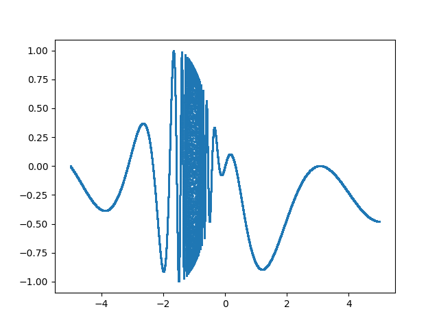
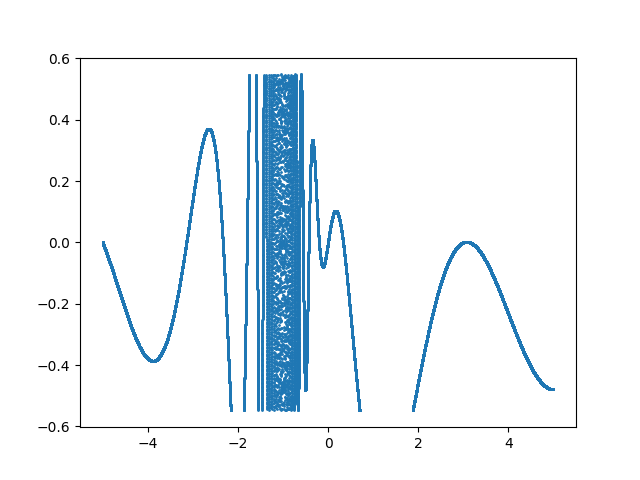
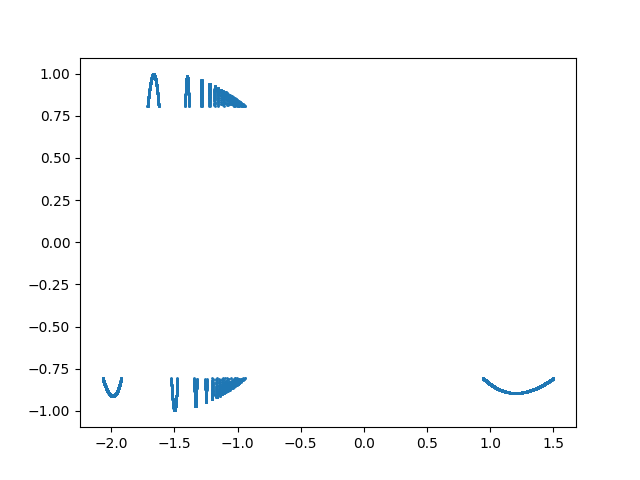

# 6: Putting it all together

Now that we have the basics down, let's try putting it all together. To do this, let's fabricate some data, save that data in a binary file, and then define the structure for that data in both Kaitai and Construct. After that, we can compile our formats and begin to manipulate and work with this data.

## 6.1 Creating example data

Let's say that the data that we're taking comes as a waveform in a binary file. We can pretend that we're measuring vibrations through some material or, current intensity in some electrical system. As we're fabricating data, not actually measuring it, the justification doesn't really matter. 

For this example we'll be working in Python as it is necessary for using Construct. If you have yet to install an IDE, a link and some instructions were provided in the [setup section (2.2)](/setup/) to install the Spyder environment.

Let's say that for some reason we want to break our data into 3 different sections depending on the intensity. The first section can describe the entire wave form, the second can capture only some mid-range values, and the third section captures only the most intense values. 

First, we'll need to make sure that all of the necessary libraries are installed and imported. For this data, we'll need the numpy library and the struct (not Construct) library. Optionally, we can also include matplotlib in order to plot our simulated data. To check if you already have these libraries installed, open your IDE's terminal and enter:
```
pip list
```
This will return an alphabetical list of all modules currently installed packages/modules that your install of Python has access to, as well as their version numbers. Simply scroll through the result to see if `matplotlib`, `numpy`, and `python-struct` are installed, and if not, run:
```
pip install numpy
pip install matplotlib
pip install python_struct
```

You should now be free to create a new `.py` or `.ipynb` file, named something like "example_data". Most IDEs will require you to save the file before allowing you to run it. 

At the beginning of your new file, import the necessary modules using the commands:
```
import numpy as np
import struct
import matplotlib.pyplot as plt
```
Now, let's initialize 6 different arrays, one for each x and y value that is being selected from each different section.
```
full_x = []
full_y = []

mid_x = []
mid_y = []

peak_x = []
peak_y = []
```
Next, we'll want to populate these arrays with their respective data. Let's create a `for` loop which will create a wave using an equation. For this example, I'll be creating a function that is defined from `x=-5` to `x=5`, creating a y data point every increment of `0.0001` on the x axis, meaning the full data will contain 100000 points. The actual function chosen for this example doesn't matter much as long as it's possible to graph in two dimensions - you can simply plot a cosine or sin function with arbitrary limits without running into any issues (as long as your computer can handle the number of data points you create):
```
for i in np.arange(-5,5,0.0001):
  # Function that is being plotted
  n = (np.cos((2 * np.pi * i**2)/(i**2 + i))) * np.sin(i)

  # Put every point in full_x and full_y
  full_x.append(i)
  full_y.append(n)

  # Select only mid range points
  if n**2 < 0.3:
    mid_x.append(i)
    mid_y.append(n)

  # Select only extrema
  if n**2 > 0.65:
    peak_x.append(i)
    peak_y.append(n)
```
You could now plot the three graphs if you wish to see what these produce by using:
```
plt.plot(full_x, full_y)
plt.show()

plt.plot(mid_x, mid_y)
plt.show()

plt.scatter(peak_x, peak_y, s=1)
plt.show()
```
The resulting graphs should look like:





Next, we'll want to load all of our wave data into separate numpy arrays. This allows us to set the datatype as `float32`, so each x and y value can be saved across 32 bits or 4 bytes of data. Feel free to experiment with this choice as well. You can save the data over twice as many bytes by using `float64` to double the resolution (and the filesize), or across fewer bytes using `float16` for 2 bytes or `float8` for 1 byte. You could even decide to flatten every point across integers if you wish by using `uint64`, `uint32`, and so on. Even complex numbers can be captured, with the options beginning at `complex64` and doubling until `complex256`. In any case, your arrays should look similar to:
```
# Save data to numpy arrays
full_y_data = np.array(full_y, dtype=np.float32)
full_x_data = np.array(full_x, dtype=np.float32)

mid_y_data = np.array(mid_y, dtype=np.float32)
mid_x_data = np.array(mid_x, dtype=np.float32)

peak_y_data = np.array(peak_y, dtype=np.float32)
peak_x_data = np.array(peak_x, dtype=np.float32)
```
The next and final step of creating our example data is to write everything we've done so far to a new `.test` file. As mentioned earlier, it is very useful to include the length of each section somewhere in our final file. It's simplest to include the length at the beginning of the file, but you could also put each length before its respective section. There are other ways to manage this kind of data, but including the lengths is one of the simplest. Here's what that looks like for this data:
```
# Save data to binary file
with open('wave_data.test', 'wb') as f:
  # Write array lengths to file as integers
  f.write(struct.pack('I', len(full_y_data)))
  f.write(struct.pack('I', len(mid_y_data)))
  f.write(struct.pack('I', len(peak_y_data)))
  
  # Write each array to the file
  full_x_data.tofile(f)
  full_y_data.tofile(f)

  mid_x_data.tofile(f)
  mid_y_data.tofile(f)

  peak_x_data.tofile(f)
  peak_y_data.tofile(f)
```
We now have a file titled "wave_data.test" saved in the same directory as our python program. The file type can be decided arbitrarily - it used to be the case that type extensions were required to be 3 characters or less, but that standard has since fallen out of use.

## 6.2 Describing the data in Kaitai

Now that we have our raw binary data, we can begin working on writing the `.ksy` file which we'll be able to use later to compile our data into something useable. If you no longer have it open, navigate back to the [Kaitai web IDE](https://ide.kaitai.io/) and create a new `.ksy` file named something like "wave_parser.ksy". We're going to start by describing the `meta` section. Our example is pretty simple, so we'll only need to fill out the `id`, `file-extension` and `endian` sections. 

Since we didn't explicitly define the endianness while creating our raw data file, it was written using your operating system's native endianness. If you are unsure what endianness your system uses, simply search "(your OS) byte order." You could also rewrite the code generating the example data to force a specific endianness. To do that, change the lines which create the arrays from:
```
full_x_data = np.array(full_x, dtype=np.float32)
.
.
.
```
To instead say:
```
# For little-endian
full_x_data = np.array(full_x, dtype='<float32') # or '<f4'
.
.
.

# For big-endian
full_x_data = np.array(full_x, dtype='>float32') # or '>f4'
.
.
.
```

Now in our `meta` section, let's add:
```
meta:
  id: test
  file-extension: test
  endian: le # or be
```
When creating our file, we used the line `f.write(struct.pack('I', len(full_data)))` to add the size of each section to the beginning of the file. In this line `I` stands for an unsigned 4-byte integer. In Kaitai, this is captured by `type: u4`, so we define a `type` called `full_mid_peak_lens` which grabs `full_len`, `mid_len`, and `peak_len` as `u4`s so that they can be used elsewhere.
```
types:
  full_mid_peak_lens:
    seq:
      - id: full_len
        type: u4
      - id: mid_len
        type: u4
      - id: peak_len
        type: u4
```
Now we can go above the `types` section to the main `seq` and create an object to store these lengths so that we can retrieve them later:
```
seq:
  - id: lengths
    type: full_mid_peak_lens
```
Next, we can use the `length` object to select arrays which are the length of each respective section of the data. It's important to remember here what choice was made to define the size of each data point. As I went with `float32`, each data point will be saved as a float valued `f4` type. Kaitai has the options of `f1`, `f2`, `f4`, and `f8`, (or `u1`, `s1`, etc) each specifying how many bytes they capture. To capture the `full_data` section, let's move back to the `types` section and continue:
```
  full_data:
    seq:
      - id: x_data
        type: f4
        repeat: expr
        repeat-expr: _root.lengths.full_len

      - id: y_data
        type: f4
        repeat: expr
        repeat-expr: _root.lengths.full_len
```
Now we can simply repeat this step for each of the sections, creating the `mid_data` and `peak_data` types before returning above the `type` section once more to the main `seq`. From there, all we have to do is create a new object for each of these types to use, which should look something like:
```
  - id: f_data
    type: full_data

  - id: m_data
    type: mid_data
  
  - id: p_data
    type: peak_data
```
And just like that, we've described our first file format using Kaitai! Make sure to save your file, and we can learn how to use our `.ksy` file to rebuild our raw data.

## 6.3 Parsing raw data with a .ksy file

It was mentioned in the page for our setup that advanced users may wish to install `ksc` for further work. Doing this install now would be necessary in order to continue, so if you have not yet followed the instructions in the [advanced section](/advanced/), please do so to continue. 

TODO: WSL Installation instructions

To get started, you'll need to know the path to your .ksy file and to the folder generated by your install of `ksc`. Then, you'll want to navigate to the generated folder using WSL.
```
cd /path/to/kaitai_struct_awkward_runtime
```
Next, you'll generate the source and header files for your target language.
```
ksc -t <language> --outdir <new_foldername> <path/to/your/file.ksy>
```
Replacing the parts in brackets accordingly. For `language`, the options are: `cpp_stl`, `csharp`, `java`, `javascript`, `perl`, `php`, `python`, `ruby`, or `all`

For `new_foldername`, the new folder will be created inside the `kaitai-struct-awkward-runtime` folder. After running the above commands, you should have generated a new folder and file. If your target (`-t`) language was python, the generated file will appear as `<extension>.py`. In my case, we now have the folder `wave_test` which contains `test.py`, so we can finally put this all together.

You can either create a new python or notebook file at the same level as your `wave_test` folder or equivalent, move/copy that folder where you want to make your parsing file, or keep the folders seperate and start your new file by running:
```
import sys
```
before using `sys.path.append()` to point to the respective folder. Having the folder on the same hierarchy as your new file will avoid this extra step however. Now, we'll want to import everything from our generated file, import `Path` in order to use the raw file, and `matplotlib.pyplot` in order to plot it:
```
from pathlib import Path
from wave_test.test import * # replace wave_test with your folder name
import matplotlib.pyplot as plt
```
We are now able to load our data file in and begin parsing it. Let's first load our raw data before parsing it as the generated `Test` class. If you didn't use the same `id` as in the example, open the generated `.py` file and use the highest level `class` - it should match the `id` from your `meta` section.
```
raw_data = Path('wave_data.test')
wave_data = Test.from_file(raw_data)
```
From here, the different types and their subtypes can be accessed directly as attributes, so we can print out each of the lengths using:
```
f_length = wave_data.lengths.full_len
m_length = wave_data.lengths.mid_len
p_length = wave_data.lengths.peak_len
print(f_length, m_length, p_length)
```
We can also access the wave data the same way:
```
full_x = wave_data.f_data.x_data
full_y = wave_data.f_data.y_data
plt.plot(full_x, full_y)
```
This can be repeated for the `mid` and `peak` data as well using `m_data` and `p_data` respectively. And with that, we have officially learned how to use a `.ksy` file to parse raw data! Let's move on to doing the same with Construct definitions.

## 6.4 Describing the data in Construct

If for some reason it's useful for your project to create a description of your file format using both Kaitai and Construct, I'd recommend first creating a Kaitai description and then basing your Construct file off of it, simply because the syntax for Kaitai is more straightforward. With that being said, let's open up a new `.py` or `.ipynb` file and begin by importing the Construct module, matplotlib.pyplot, and numpy before defining our Structs. 
```
from construct import *
import matplotlib.pyplot as plt
import numpy as np
```
Next, as before, we'll want to capture the three numbers at the front of the file which tell us how long each array is. Our approach here will look much like our Kaitai work, but there are still multiple different ways to perform this capture, and experimenting to see what feels most efficient for you is definitely encouraged.

For this example, I'm going to start off with what will eventually be the final Struct and create a sub Struct which will use the values captured here.
```
test_struct = Struct(
  "lengths" / Struct(
    "full_data_len" / Int32ul,
    "mid_data_len" / Int32ul,
    "peak_data_len" / Int32ul
  )
)
```
As mentioned previously, this Struct will come last. This is a limitation of Python more than of Construct, as Python is unable to use variables or Structs that have yet to be declared. But since the Struct that comes before this one will only be **used** when it's later nested into `test_struct`, we'll be able to reference the `lengths` sub-Struct to capture the full, mid, and peak data lengths. Each of the data sections will select 4 bytes at a time and save them into an array of the stated length.
```
data_sections = Struct(
    "full_x_data" / Array(
        this._root.lengths.full_data_len,
        Float32l
    ),
    "full_y_data" / Array(
        this._root.lengths.full_data_len,
        Float32l
    ),
    
    "mid_x_data" / Array(
        this._root.lengths.mid_data_len,
        Float32l
    ),
    "mid_y_data" / Array(
        this._root.lengths.mid_data_len,
        Float32l
    ),
    
    "peak_x_data" / Array(
        this._root.lengths.peak_data_len,
        Float32l
    ),
    "peak_y_data" / Array(
        this._root.lengths.peak_data_len,
        Float32l
    ),
)
```
Now we can simply add this Struct into `test_struct` as:
```
test_struct = Struct(
    "lengths" / Struct(
        "full_data_len" / Int32ul,
        "mid_data_len" / Int32ul,
        "peak_data_len" / Int32ul
    ),
    "data_sects" / data_sections
)
```
For selections that only have one defining Struct, like `data_sects`, there isn't necessarily a reason not to also name the sub Struct (`data_sects`) after the Struct that it's using (`data_sections`). In this case, it's simply a matter of shortening the name to reduce how much typing is necessary to call that attribute later. It's not uncommon to have a Struct with a very clear name which is then given a shortened name in the Struct that actually uses it. Remember when doing this that only the quoted name will be useable. If You try to reference `data_sections` instead of `data_sects`, you'll end up with a `KeyError`.

## 6.5 Parsing raw data using Construct

This process is much simpler than with Kaitai - you can do all of the work from the same file as where you set the Structs. Let's now just create a function that parses our file and then plots the results:
```
def parse_file(input_path):
  with open(input_path, 'rb') as input_f: # 'rb' ='read binary'
    raw_data = input_f.read()
    parsed_data = test_struct.parse(raw_data)

    # Select all relevant values
    full_x_data = parsed_data.data_sects.full_x_data
    full_y_data = parsed_data.data_sects.full_y_data

    mid_x_data = parsed_data.data_sects.mid_x_data
    mid_y_data = parsed_data.data_sects.mid_y_data

    peak_x_data = parsed_data.data_sects.peak_x_data
    peak_y_data = parsed_data.data_sects.peak_y_data

    # Plot all data
    plt.plot(full_x_data, full_y_data)
    plt.plot()
    plt.show()

    plt.scatter(mid_x_data, mid_y_data, s=1)
    plt.plot()
    plt.show()

    plt.scatter(peak_x_data, peak_y_data, s=1)
    plt.plot()
    plt.show()
```
Now all that's left is to call our `parse_file` function:
```
input_path = </your/path/to/wave_data.test>
parse_file(input_path)
```
And you have officially parsed your first file using Construct!